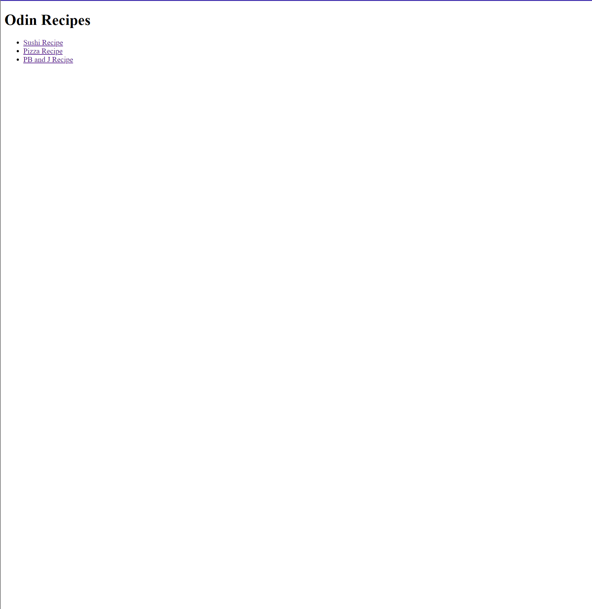
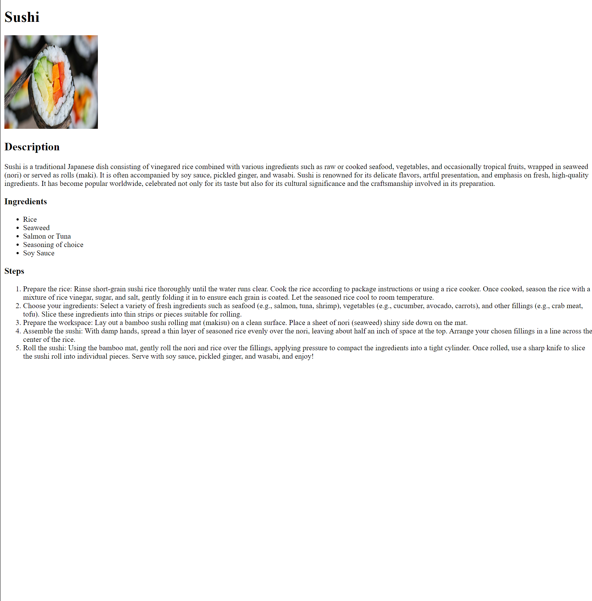

# odin-recipes
My first small project in html, I am going to be making a recipes website 

This is how my website looked in the beginning with just html

Then after learning css it now looks like:
